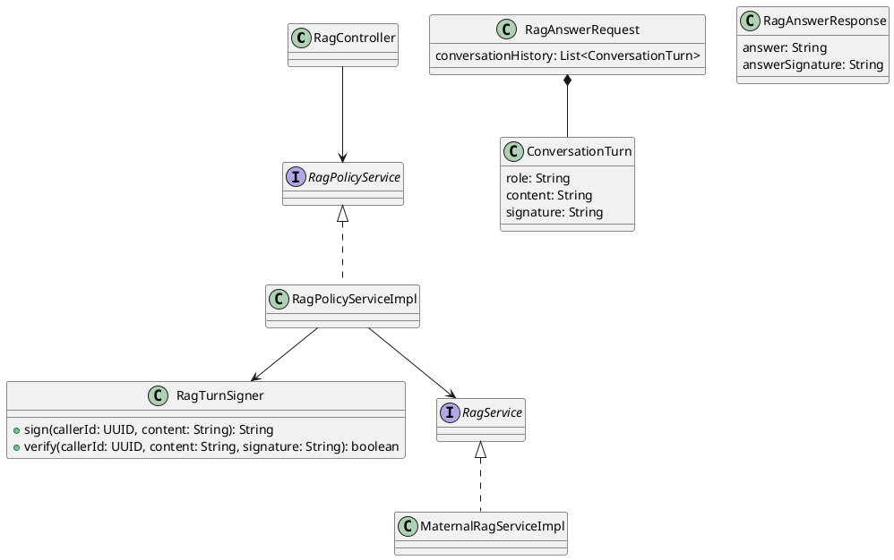
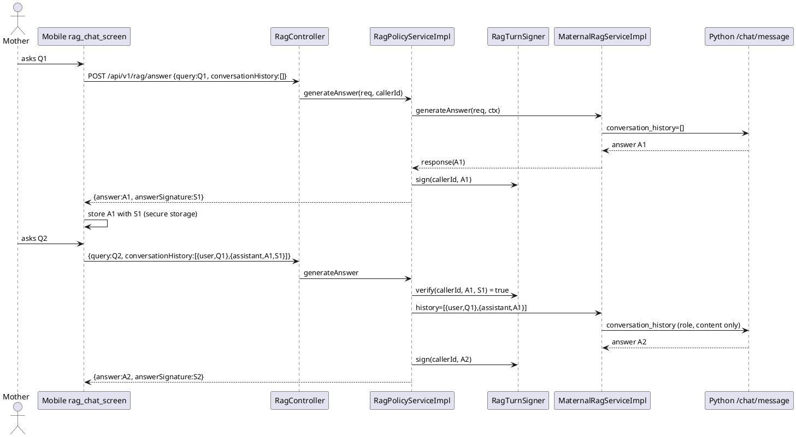

# ENGINEERING DOCUMENTATION STANDARD (EDS) v2.0
# Technical Design Specification — `RAG Conversation History Integrity`

| Field | Value |
| --- | --- |
| **Document ID** | `RCHI-TDS` |
| **Version** | `0.1` |
| **Date** | `2026-09-22` |
| **Status** | `Draft` |
| **Document Owner** | `CareBridge Team` |
| **Author** | `AI Agent` |
| **Reviewed by** | `Open` |
| **DPO Sign-off** | `Not applicable — the design stores no new personal or health data; it removes trust in client-supplied content rather than persisting it (see §5.3)` |
| **Approved by** | `Open` |
| **Last Review** | `2026-09-22` |
| **Based on EDS** | `v2.0` |

> Drafts must not claim approval, implementation completion, test success, legal
> compliance, clinical accuracy, availability, or latency without dated evidence.

---

## CHANGELOG

| Date | Author | Change |
| --- | --- | --- |
| `2026-09-22` | `AI Agent` | Initial code- and source-researched Draft. Design option B (HMAC-signed assistant turns) and Backend + Mobile scope selected by the user on 2026-09-22. |

---

## TABLE OF CONTENTS

1. [Module Overview](#1-module-overview)
2. [Traceability Matrix](#2-traceability-matrix)
3. [Architecture Decision Records](#3-architecture-decision-records-adr)
4. [Non-Functional Requirements and SLA](#4-non-functional-requirements-and-sla)
5. [Static Modeling](#5-static-modeling)
6. [Dynamic Modeling](#6-dynamic-modeling)
7. [Domain Event Catalog](#7-domain-event-catalog)
8. [Interface Specification](#8-interface-specification)
9. [API Specification](#9-api-specification)
10. [Error Codes](#10-error-codes)
11. [Implementation and Deployment Plan](#11-implementation-and-deployment-plan)
12. [Rollback and Incident Runbook](#12-rollback-and-incident-runbook)
13. [Verification Scenario Groups](#13-verification-scenario-groups)
14. [Verification Methods](#14-verification-methods)
15. [Verification Samples](#15-verification-samples)
16. [Authorization Matrix](#16-authorization-matrix)
17. [AI Prompt Constraints — CASE 2.0](#17-ai-prompt-constraints--case-20)

---

## 1. Module Overview

| Field | Value |
| --- | --- |
| **Feature Name** | `RAG Conversation History Integrity` |
| **Bounded Context** | Backend `com.carebridge.backend.integration.gemini`; Mobile `lib/features/aiTriage` |
| **Function / UC IDs** | `UC-AI-01` (Use AI Nurse RAG Chat) — hardening item `#14` of the AI Nurse audit |
| **SRS Reference** | `04_Implement/UC-AI-01-UseAINurseRagChat/UseAINurseRagChat_TDS.md` (BR-01, BR-05: history is part of the chat contract); `04_Implement/AINursePromptAudit/AI-Nurse-Prompt-Coverage-Audit.md` §B2 #14 and §G2 "Chưa hoàn tất" (forged `conversation_history`) |
| **Primary Actor** | MOTHER, FAMILY (Mobile `/rag/chat`) |
| **Secondary Actors** | Spring backend `RagPolicyServiceImpl`; Python AI service `POST /api/v1/chat/message` (unchanged) |
| **Trigger** | The actor sends a follow-up question in an existing chat; Mobile attaches earlier turns as `conversationHistory` |
| **User Outcome** | Follow-up questions keep genuine conversational context; assistant turns that the server did not produce for this user never reach the model |
| **Platforms** | Backend, Mobile. Python AI service: no change. Web: not applicable (no RAG chat client — `git grep "rag/answer"` in `05_Development/CareBridgeWebApp/src` returns nothing) |
| **Priority** | `Open unless sourced` (audit marks the item 🟡 not done) |
| **Data Classification** | Conversation content: Confidential / health context (UC-AI-01 TDS header "Confidential conversation history"). Signing key: Secret |
| **Compliance Scope** | Preserve RBAC and AI safety rules (CLAUDE.md "Safety Rules": AI guidance must never be steerable into diagnosing/prescribing). No new retention or consent obligation because nothing new is stored server-side |
| **Upstream Dependencies** | `RagController`, `RagPolicyServiceImpl`, `RagService` implementations, Spring configuration `ai.maternal-rag.*` |
| **Downstream Consumers** | Mobile `rag_chat_screen.dart`; `MaternalRagServiceImpl` payload to Python; `TriageRagEnrichmentService` (uses `RagPolicyService`, sends no history) |

### 1.1 Current-State Baseline

- Mobile builds `historyPayload` from every on-screen message except the newest (`rag_chat_screen.dart`, `_messages.take(_messages.length - 1)`), with `role` `user`/`assistant` and the displayed text. Assistant turns include text the app itself generated when the backend was unreachable or rejected the query ("Không thể kết nối…", "Câu hỏi hơi ngắn…").
- Mobile persists sessions in `FlutterSecureStorage` under `carebridge_ai_rag_sessions_<uid>` via `_ChatSession.toJson()` / `_Message.toJson()` (fields `text,isUser,time,sources,followups,isWarning`).
- `RagController.generateAnswer` validates `query` (3–500 chars, `RAG-001`) and `maxContextChunks` (≤10, `RAG-002`); `conversationHistory` is not validated.
- `RagPolicyServiceImpl.generateAnswer` runs `RagSafetyFilter`, resolves the stage, delegates to `RagService`; it never inspects history.
- `MaternalRagServiceImpl.toHistory` keeps the last `MAX_HISTORY_TURNS = 10` turns, truncates each to `MAX_HISTORY_TURN_CHARS = 2_000`, maps any role equal (ignore case) to `assistant` as `assistant`, everything else as `user`, and forwards them verbatim as `conversation_history`. Its Javadoc states history "arrives from the client, so it is bounded here rather than trusted" — bounded in size only, not in authenticity.
- Python `build_rag_chat_prompt` puts up to the last six turns into the prompt; `RagChatService._expand_with_history` uses only user turns for retrieval. The prompt marks history as data, not instructions (audit §G1) — a prompt-level mitigation only.
- `GeminiRagServiceImpl` (fallback) and `FallbackRagServiceImpl` do not read history.
- Consequence: any authenticated client can send `{"role":"assistant","content":"<anything>"}` and the model receives it as something it previously said (audit #14).
- Existing tests: `RagPolicyServiceTest` (uses `@InjectMocks`), `RagControllerTest` (`@WebMvcTest`), Mobile `test/features/aiTriage/*` (none covers history).

### 1.2 In Scope

- Backend issues an HMAC signature for every answer returned by `POST /api/v1/rag/answer`, bound to the authenticated caller.
- Backend accepts an optional per-turn signature and forwards an `assistant` turn only when its signature verifies for the current caller and the exact turn content; other assistant turns are dropped before any `RagService` call.
- User turns remain accepted as today (they are the caller's own words).
- Mobile stores the signature with each assistant message, persists it in the session store, and sends it back in `conversationHistory`.
- Configuration of the signing key through an environment variable; deployment descriptors updated.

### 1.3 Out of Scope

- Server-side storage of chat turns (option A, rejected by the user on 2026-09-22).
- Changing the Python AI service contract (`conversation_history` keeps `role`,`content`).
- Key rotation with multiple active keys (see `OPEN-02`).
- Replay of the caller's own genuine answers across sessions or out of order — accepted (§3 ADR-RCHI-001 Consequences).
- Content a user types into a *user* turn that imitates the assistant: this is equivalent to typing it as the question and remains covered only by the prompt's "history is data" rule.
- Web client (no RAG chat surface).

### 1.4 Preconditions and Postconditions

| Type | ID | Condition | Oracle source |
| --- | --- | --- | --- |
| Precondition | `PRE-01` | Caller is authenticated with a role allowed by `RagController` `@PreAuthorize` | `RagController.java` |
| Precondition | `PRE-02` | Backend has a signing key (configured, or an ephemeral key generated at startup in non-production) | ADR-RCHI-002 |
| Postcondition | `POST-01` | Every `200` response of `/api/v1/rag/answer` carries a non-blank `answerSignature` that verifies for (caller, `answer`) | ADR-RCHI-001 |
| Postcondition | `POST-02` | No `assistant` turn reaches `RagService` unless its signature verified for the caller and the exact content | Audit #14; user decision 2026-09-22 |
| Postcondition | `POST-03` | Request never fails because of a missing/invalid turn signature (turn is dropped, answer still produced) | ADR-RCHI-001 |

### 1.5 Open Questions and Contradictions

| ID | Question or contradiction | Evidence | Decision required |
| --- | --- | --- | --- |
| `OPEN-01` | UC-AI-01 TDS says Mobile "calls Python directly with literal internal key `carebridge`, then falls back to Spring"; current Mobile calls only `POST /api/v1/rag/answer` (comment in `rag_chat_screen.dart` above `historyPayload`). | `UseAINurseRagChat_TDS.md` §9 row `UC-AI-01`; `rag_chat_screen.dart` | Not blocking: this design follows current code (only the Spring path exists). UC-AI-01 TDS should be corrected separately. |
| `OPEN-02` | Key rotation: should a previous key remain valid for verification during rotation? | No source | Product/ops decision. Without it, rotating the key drops older assistant turns (graceful degradation, §6.3 `ERR-03`). |
| `OPEN-03` | Should dropped-turn counts be exposed as a metric, not only a log line? | No observability requirement sourced | Ops decision; this Draft specifies a WARN log only. |

---

## 2. Traceability Matrix

| Requirement / Decision ID | Type | Requirement or decision | Source location | Owning component | Test condition |
| --- | --- | --- | --- | --- | --- |
| `AUD-14` | Audit finding | Client-supplied `conversation_history` can be forged; backend must stop trusting it | `AI-Nurse-Prompt-Coverage-Audit.md` §B2 #14, §G2 "Chưa hoàn tất" | `RagPolicyServiceImpl` | `COND-02`, `COND-03`, `COND-04` |
| `DEC-01` | User decision | Option B: HMAC-sign assistant answers; forward only verified assistant turns | User answer, 2026-09-22 session | `RagTurnSigner`, `RagPolicyServiceImpl` | `COND-01`…`COND-06` |
| `DEC-02` | User decision | Scope Backend + Mobile; Python unchanged | User answer, 2026-09-22 session | Backend, Mobile | `COND-07`, `COND-08`, `COND-09` |
| `BR-01` (UC-AI-01) | BR | History remains part of the chat contract | `UseAINurseRagChat_TDS.md` §2 `BR-01` | `MaternalRagServiceImpl` | `COND-05` |
| `BR-05` (UC-AI-01) | BR | Retrieval expansion uses user turns; prompt uses last six messages | `UseAINurseRagChat_TDS.md` §2 `BR-05` | Python (unchanged) | `COND-04` (user turns untouched) |
| `ADR-RCHI-001` | ADR | Signature binds caller id + exact content; invalid ⇒ drop, not reject | §3 | `RagTurnSigner` | `COND-02`, `COND-03`, `COND-06` |
| `ADR-RCHI-002` | ADR | Key from `AI_RAG_TURN_SIGNING_KEY`; ephemeral in non-prod; required in prod/staging compose | §3 | `RagTurnSigner` config | `COND-10` |
| `SAFE-01` | Project rule | Preserve RBAC; do not weaken validation; AI must not be steerable into diagnosis/prescription | `CLAUDE.md` "Safety Rules" | `RagController`, `RagPolicyServiceImpl` | `COND-11` |

Every in-scope statement appears above. Code is evidence of current state, not automatic authority for the desired state.

---

## 3. Architecture Decision Records (ADR)

### ADR-RCHI-001 — Authenticate assistant turns with a caller-bound HMAC instead of storing history

| Field | Value |
| --- | --- |
| **Status** | `Proposed` (option chosen by user 2026-09-22; ADR awaits TDS approval) |
| **Date** | `2026-09-22` |
| **Deciders** | Project owner (user) |
| **Sources** | Audit #14; user decision `DEC-01`; current code §1.1 |

#### Context

The backend is stateless for chat: it has no table for chat turns and Mobile keeps sessions locally. The model is told what "it" said earlier purely from client input. Prompt fencing reduces but does not remove the risk (audit §G2 🟡).

#### Options Considered

| Option | Benefits | Costs / Risks |
| --- | --- | --- |
| A — persist turns server-side, rebuild history by session id | Strongest: history fully server-owned | New table + Flyway, session lifecycle, storage of health conversation ⇒ retention/consent decisions not present in SRS; largest Mobile/API change |
| B — HMAC-sign each answer, forward only verified assistant turns | No new storage or table; small API delta; keeps follow-up context | New secret to manage; genuine answers can be replayed by the same user; key change invalidates older turns |
| C — drop all assistant turns | Trivial, no secret | Loses the context BR-01/BR-05 rely on for follow-ups ("còn bao lâu nữa?") |

#### Decision

Option B (user decision 2026-09-22). Details:

1. `signature = "v1." + base64url_nopad(HMAC-SHA256(key, "carebridge.rag.turn.v1" + "\n" + callerId + "\n" + content))`, content as UTF-8, exact bytes (no trimming or normalisation).
2. Verification uses a constant-time comparison (`MessageDigest.isEqual`).
3. A turn whose role equals `assistant` (ignore case) is forwarded only if the signature verifies; otherwise it is dropped. Turns with any other role are forwarded as `user` (unchanged behaviour of `MaternalRagServiceImpl.toHistory`).
4. Invalid or missing signatures never fail the request (graceful: legacy sessions and app-generated notices lose their context, the answer is still produced).
5. Verification happens in `RagPolicyServiceImpl` on the full content, before `MaternalRagServiceImpl` truncates to 2 000 chars. The policy delegates a **filtered copy** of the request (new `RagAnswerRequest` built from the original fields plus the filtered history); it must not mutate the caller's `RagAnswerRequest` (the DTO has `@Setter`, so in-place mutation would be possible and is forbidden).
6. Every answer returned by `RagPolicyServiceImpl` is signed, including the red-flag guidance and fallback answers, because they are server-produced.

#### Consequences

- Positive: forged assistant turns never reach the model; no new personal data at rest.
- Trade-off: the same user can replay their own genuine answers in another session or order (the text is still something the server said to them). Accepted.
- Compatibility: request/response gain optional fields only; old Mobile builds keep working but lose assistant context (their turns carry no signature).

### ADR-RCHI-002 — Signing key source and startup behaviour

| Field | Value |
| --- | --- |
| **Status** | `Proposed` |
| **Date** | `2026-09-22` |
| **Deciders** | `Open` (ops) |
| **Sources** | `.env.example` (secrets pattern), `docker-compose.production.yml` (`${VAR:?…}` pattern for required secrets), CLAUDE.md "Environment And Secrets" |

#### Context

A secret is needed. The repository requires secrets through environment variables and never commits key material.

#### Options Considered

| Option | Benefits | Costs / Risks |
| --- | --- | --- |
| Required everywhere (fail startup when missing) | No silent misconfiguration | Breaks every local/dev/test run until configured |
| Ephemeral random key when missing + required in staging/production compose | Local dev works; production cannot start without it | Local restart invalidates older signatures (acceptable) |

#### Decision

Property `ai.maternal-rag.turn-signing-key: ${AI_RAG_TURN_SIGNING_KEY:}` holding base64 of ≥ 32 random bytes. When blank, generate a 32-byte `SecureRandom` key at startup and log one WARN (never the key). When present but not valid base64 or shorter than 32 bytes after decoding, fail startup with `IllegalStateException`. Staging and production compose declare `AI_RAG_TURN_SIGNING_KEY: ${AI_RAG_TURN_SIGNING_KEY:?Set the RAG turn signing key}`.

#### Consequences

- Positive: misconfigured production cannot start; developers need no setup.
- Trade-off: multiple backend replicas **must** share the configured key (an ephemeral key per replica would drop turns across replicas). Covered by the compose requirement.
- Compatibility: no schema or API break.

---

## 4. Non-Functional Requirements and SLA

| Category | Requirement | Target | Verification method | Oracle source |
| --- | --- | --- | --- | --- |
| Performance | HMAC over ≤ 10 turns × ≤ request size adds no provider call | `Open unless sourced` (no latency SLA for RAG exists) | Code review: no I/O added | ADR-RCHI-001 |
| Availability | Signature problems must not fail a chat request | 0 requests rejected for signature reasons | `COND-06` tests | ADR-RCHI-001 decision 4 |
| Security | Forged / cross-user / tampered assistant turns never reach `RagService` | 100 % of such turns dropped in tests | `COND-02`, `COND-03`, `COND-04` | AUD-14 |
| Security | Key never logged, never returned, never committed | No occurrence | Log/`.env.example`/grep inspection §14.2 | CLAUDE.md Environment And Secrets |
| Privacy | Dropped-turn log contains a count only — no content, no caller id | No content in logs | `COND-11` | UC-AI-01 TDS §4 "Protected-data handling" |
| Accessibility | Not applicable — no UI change visible to the user | — | — | — |
| Data integrity | Signature is over exact content; any byte change invalidates | Tampered turns dropped | `COND-03` | ADR-RCHI-001 |

---

## 5. Static Modeling

### 5.1 Component Responsibilities and Planned Paths

| Platform / Layer | Current or planned path | Symbol / artifact | Responsibility | Change type |
| --- | --- | --- | --- | --- |
| Backend Controller | `05_Development/CareBridgeAPI/src/main/java/com/carebridge/backend/integration/gemini/controller/RagController.java` | `RagController.generateAnswer` | Transport only; unchanged validation | None |
| Backend DTO | `…/integration/gemini/dto/RagAnswerRequest.java` | `RagAnswerRequest.ConversationTurn.signature` | New optional field | Modify |
| Backend DTO | `…/integration/gemini/dto/RagAnswerResponse.java` | `RagAnswerResponse.answerSignature` | New field | Modify |
| Backend Policy | `…/integration/gemini/policy/RagTurnSigner.java` | `RagTurnSigner` | Key loading, `sign`, `verify` | Add |
| Backend Service | `…/integration/gemini/service/RagPolicyServiceImpl.java` | `generateAnswer` | Filter history before delegation; sign every returned answer | Modify |
| Backend Service | `…/integration/gemini/service/MaternalRagServiceImpl.java` | `toHistory` | Unchanged mapping; signature is never forwarded (payload keeps `role`,`content`) | None (verified by test) |
| Config | `05_Development/CareBridgeAPI/src/main/resources/application.yaml` | `ai.maternal-rag.turn-signing-key` | Property binding | Modify |
| Config | `05_Development/CareBridgeAPI/.env.example` | `AI_RAG_TURN_SIGNING_KEY=` | Documented placeholder, empty value | Modify |
| Deployment | `05_Development/Deployment/docker-compose.production.yml`, `docker-compose.staging.yml` | backend `environment` | Require the key | Modify |
| Mobile model | `05_Development/CareBridgeMobileApp/lib/features/aiTriage/models/rag_chat_message.dart` | `RagChatMessage` | Public message model (moved out of the screen so it is testable): JSON with optional `signature`, `toHistoryTurn()` | Add (extracted from `_Message`) |
| Mobile screen | `05_Development/CareBridgeMobileApp/lib/features/aiTriage/screens/rag_chat_screen.dart` | `_Message`, `_ChatSession`, send flow | Use `RagChatMessage`; store `answerSignature`; build history via `toHistoryTurn()` | Modify |
| Python AI service | `05_Development/CareBridgeAITriageService/app/models/schemas.py` | `ChatMessage` | No change | None |

### 5.2 Class / Component Diagram



### 5.3 Data Model and Schema Delta

| Table / Store | Current fields used | Planned delta | Classification | Owner |
| --- | --- | --- | --- | --- |
| PostgreSQL | None — chat turns are not stored | None | — | — |
| Mobile `FlutterSecureStorage` key `carebridge_ai_rag_sessions_<uid>` | message `text,isUser,time,sources,followups,isWarning` | Add optional `signature` (string) per message; absent in legacy data | Confidential (already stored) | Mobile `aiTriage` |

#### Migration Plan

- Current authoritative baseline: `V1__init_schema.sql` + Flyway history — untouched.
- Existing relevant migrations: none (no chat table exists).
- New migration required: `No`.
- Collision check: not applicable.
- Baseline sync action: Not applicable — no schema change.
- Roll-forward and data-backfill constraints: Mobile reads legacy messages without `signature` (null); no backfill possible or needed (legacy assistant turns simply stop being forwarded).

---

## 6. Dynamic Modeling

### 6.1 Happy Path Sequence



### 6.2 Alternative and Empty-State Flows

| Flow ID | Trigger | Behavior | Postcondition | Oracle |
| --- | --- | --- | --- | --- |
| `ALT-01` | No `conversationHistory` or empty list | No verification; delegation unchanged | Answer signed | ADR-RCHI-001 |
| `ALT-02` | History contains only user turns | All forwarded unchanged | Same as today | ADR-RCHI-001 decision 3 |
| `ALT-03` | Red-flag query (`RagSafetyFilter`) | Early return as today, answer signed | `answerSignature` present | ADR-RCHI-001 decision 6 |
| `ALT-04` | Legacy session (assistant turns without `signature`) | Assistant turns dropped, user turns forwarded | Answer produced | ADR-RCHI-001 decision 4 |
| `ALT-05` | App-generated notice stored as assistant message (connection error / "câu hỏi hơi ngắn") | No signature ⇒ dropped | Model never sees app-made text as its own words | §1.1; ADR-RCHI-001 |
| `ALT-06` | `TriageRagEnrichmentService` call (no history) | Unchanged; answer signed, signature unused | No behaviour change for triage | `TriageRagEnrichmentService.java` |

### 6.3 Error, Timeout, Retry, and Concurrency Flows

| Flow ID | Failure or race | Detection | System response | Side effects | Oracle |
| --- | --- | --- | --- | --- | --- |
| `ERR-01` | Assistant turn content edited by client | `verify` false | Turn dropped; WARN `RagHistoryTurnsDropped count=<n>` | None | ADR-RCHI-001 |
| `ERR-02` | Signature issued for another user | `verify` false (caller id bound) | Turn dropped | None | ADR-RCHI-001 |
| `ERR-03` | Key rotated / ephemeral key after restart | `verify` false | Turns dropped, answer produced | None | ADR-RCHI-002 |
| `ERR-04` | Malformed signature (null, blank, no `v1.` prefix, bad base64, wrong length) | `verify` returns false, never throws | Turn dropped | None | ADR-RCHI-001 |
| `ERR-05` | Configured key invalid (not base64 / < 32 bytes) | Startup | `IllegalStateException`, application does not start | None | ADR-RCHI-002 |
| `ERR-06` | Python service down | Existing fallback in `MaternalRagServiceImpl` | Fallback answer, signed | None | §1.1; ADR-RCHI-001 decision 6 |
| `ERR-07` | Concurrent requests | Signer is stateless and thread-safe (new `Mac` per call or `ThreadLocal`) | No shared mutable state | None | Implementation constraint C5 |

### 6.4 State Machine and Invariants

Not applicable — no persisted lifecycle. Invariants:

- `INV-01`: an `assistant` turn reaches `RagService` ⇒ `verify(callerId, content, signature)` was true in the same request.
- `INV-02`: every `RagAnswerResponse` returned by `RagPolicyServiceImpl` has `answerSignature = sign(callerId, answer)`.
- `INV-03`: `verify` never throws for any client input.
- `INV-04`: the signing key and signatures never appear in the payload sent to Python.

---

## 7. Domain Event Catalog

| Event | Published by | Trigger | Payload schema | Consumers | Delivery / retry |
| --- | --- | --- | --- | --- | --- |
| Not applicable | — | — | — | — | The module uses direct synchronous calls only; no event is introduced. |

---

## 8. Interface Specification

### 8.1 Service Interfaces

```java
// Signature-only contract. No implementation body.
public interface RagPolicyService {                      // unchanged signature
    RagAnswerResponse generateAnswer(RagAnswerRequest request, RagAudienceContext context);
}

// New policy component (concrete, Spring @Component).
public final class RagTurnSigner {
    public RagTurnSigner(@Value("${ai.maternal-rag.turn-signing-key:}") String base64Key);
    public String sign(UUID callerId, String content);
    public boolean verify(UUID callerId, String content, String signature);
}
```

### 8.2 Repository Interfaces

Not applicable — no persistence.

### 8.3 Client and External Adapter Interfaces

| Interface | Input | Output | Timeout / retry | Failure mapping | Source |
| --- | --- | --- | --- | --- | --- |
| Python `POST /api/v1/chat/message` | `conversation_history: [{role, content}]` (unchanged; no signature field) | unchanged | existing `ai.maternal-rag.request-timeout-ms` (45 000) | existing fallback | `MaternalRagServiceImpl` |

---

## 9. API Specification

### 9.1 Endpoint Table

| Method | Path | Handler | Exact source | Authentication / roles / scope | Request type | Response type | Explicit statuses |
| --- | --- | --- | --- | --- | --- | --- | --- |
| `POST` | `/api/v1/rag/answer` | `RagController.generateAnswer` | `integration/gemini/controller/RagController.java` | JWT; `hasAnyRole('MOTHER','FAMILY','EXPERT','MODERATOR','CONTENT_ADMIN','SYSTEM_ADMIN')` (unchanged) | `RagAnswerRequest` | `ApiResponse<RagAnswerResponse>` | `200`, `400 RAG-001`, `400 RAG-002`, `401`, `403` (unchanged) |

### 9.2 Request / Response Contract

#### `POST /api/v1/rag/answer`

| Item | Exact current contract |
| --- | --- |
| Handler / source | `RagController.generateAnswer` / `RagController.java` |
| Authorization | Unchanged `@PreAuthorize`; caller id from `SecurityUtils.requireCurrentUserId(principal)` is the binding identity |
| Parameters | Body `RagAnswerRequest`; `Principal` |
| Request fields / validators | Unchanged: `query` 3–500 (`RAG-001`), `maxContextChunks` ≤ 10 (`RAG-002`). **Added**: `conversationHistory[].signature: String` — optional, no validator, never rejected |
| Response fields | Unchanged fields + **added** `answerSignature: String` (always present on 200) |
| Positive / negative test mapping | `COND-01`, `COND-05` / `COND-02`, `COND-03`, `COND-04`, `COND-06` |

**Request**

```json
{
  "query": "Còn bao lâu nữa thì hết ốm nghén?",
  "conversationHistory": [
    {"role": "user", "content": "Em bị ốm nghén tuần 8"},
    {"role": "assistant", "content": "<exact answer text previously received>", "signature": "v1.<base64url>"}
  ]
}
```

**Success response**

```json
{
  "success": true,
  "data": {
    "answer": "<answer>",
    "answerSignature": "v1.<base64url>",
    "disclaimer": "…",
    "sources": [],
    "fallback": false,
    "needExpertConsultation": false,
    "hasCriticalWarning": false,
    "suggestedFollowups": [],
    "generatedAt": "2026-09-22T10:00:00"
  }
}
```

**Validation, authorization, conflict, and dependency responses**

| Condition | HTTP | Error code | Response rule | Oracle |
| --- | --- | --- | --- | --- |
| Invalid/missing turn signature | `200` | — | Turn dropped silently; answer produced | ADR-RCHI-001 decision 4 |
| Query invalid | `400` | `RAG-001` | Unchanged | `RagException.invalidQuery` |
| `maxContextChunks` > 10 | `400` | `RAG-002` | Unchanged | `RagException.contextChunksExceeded` |
| Unauthenticated | `401` | — | Unchanged | `RagControllerTest.generateAnswer_noAuth_shouldReturn401` |

---

## 10. Error Codes

| Code | HTTP status | Message / semantic | Trigger | Owning mapper | Test condition |
| --- | --- | --- | --- | --- | --- |
| None added | — | Signature failures are not errors by design (ADR-RCHI-001 decision 4) | — | — | `COND-06` |
| `RAG-001`, `RAG-002` | 400 | Unchanged | Unchanged | `RagException` | Regression only (`COND-11`) |

---

## 11. Implementation and Deployment Plan

### 11.1 Prerequisites

- [ ] TDS and paired Test-Spec reviewed; status remains Draft until human approval.
- [ ] `OPEN-02` (rotation) accepted as out of scope or decided.
- [ ] A 32-byte base64 key generated for staging/production and stored in the deployment secret store (never in git).

### 11.2 Ordered Implementation Steps

1. Not applicable — no migration.
2. Backend: add `integration/gemini/policy/RagTurnSigner.java`; add `ConversationTurn.signature` and `RagAnswerResponse.answerSignature`; modify `RagPolicyServiceImpl` (filter history before delegation, sign every returned answer including the red-flag branch); add property to `application.yaml`.
3. Backend tests: new `RagTurnSignerTest`; extend `RagPolicyServiceTest` (existing tests must provide a real `RagTurnSigner` with a fixed synthetic key, because `@InjectMocks` would otherwise inject `null`); extend `RagControllerTest` for the JSON contract; new `MaternalRagServiceHistoryPayloadTest` capturing the outbound payload with a local `com.sun.net.httpserver.HttpServer`.
4. API/security: no controller change.
5. Web: Not applicable.
6. Mobile: extract `_Message` into `lib/features/aiTriage/models/rag_chat_message.dart` (`RagChatMessage` with optional `signature`, `toJson`, `fromJson`, `toHistoryTurn`); modify `rag_chat_screen.dart` to store `resData['answerSignature']` and build `historyPayload` via `toHistoryTurn()`; new `test/features/aiTriage/rag_chat_message_test.dart`.
7. Config: `.env.example` placeholder (empty); staging/production compose require the variable.

### 11.3 Compatibility Strategy

- API compatibility: additive fields only. Old Mobile builds ignore `answerSignature` and send unsigned assistant turns, which are dropped ⇒ they keep working with user-turn context only.
- Data compatibility: legacy stored sessions parse with `signature = null`.
- Client rollout order: backend first (safe with any client), then Mobile.
- Feature flag / staged rollout: `Open` — none sourced; not required because the change is additive and fail-soft.

### 11.4 Deployment Checklist

- [ ] No migration.
- [ ] `./mvnw test -Dtest='RagTurnSignerTest,RagPolicyServiceTest,RagControllerTest,MaternalRagServiceHistoryPayloadTest'`
- [ ] Web: not applicable.
- [ ] `flutter analyze` and `flutter test test/features/aiTriage/rag_chat_message_test.dart`
- [ ] `AI_RAG_TURN_SIGNING_KEY` set in staging/production secrets; all backend replicas share it.

---

## 12. Rollback and Incident Runbook

### 12.1 Rollback Triggers

| Trigger | Threshold | Decision owner |
| --- | --- | --- |
| Follow-up answers lose context for current Mobile builds (assistant turns always dropped) | `Open unless sourced` | Backend owner |
| Backend fails to start after deploy | Any | Ops |

### 12.2 Rollback Procedure

Revert the backend commit; the added request/response fields are optional, so current Mobile builds keep working against the reverted backend (they send a signature nobody reads). Reverting Mobile alone is also safe. No data or migration to roll back. If the key is suspected leaked, rotate it: all earlier signatures become invalid, which only drops older assistant turns (ERR-03).

### 12.3 Notification and Post-Incident Review

`Open` — no incident channel is sourced for this module.

---

## 13. Verification Scenario Groups

Detailed test cases belong in the paired Test-Spec.

| Group | Conditions | Test-Spec IDs |
| --- | --- | --- |
| Happy path | `COND-01`, `COND-05` | `RCHI-TC-001`, `RCHI-TC-002`, `RCHI-TC-007` |
| Boundary / validation | `COND-04`, `COND-06` | `RCHI-TC-004`, `RCHI-TC-005`, `RCHI-TC-006` |
| Authorization / ownership | `COND-02` | `RCHI-TC-003` |
| State / concurrency / idempotency | `COND-03`, `COND-12` | `RCHI-TC-003`, `RCHI-TC-013` |
| Privacy / safety | `COND-08`, `COND-11` | `RCHI-TC-008`, `RCHI-TC-012` |
| Provider failure / recovery | `COND-05` (fallback signed) | `RCHI-TC-002` |
| Config | `COND-10` | `RCHI-TC-011` |
| Mobile | `COND-07`, `COND-09` | `RCHI-TC-009`, `RCHI-TC-010` |

---

## 14. Verification Methods

### 14.1 Automated Commands

```bash
# Backend
cd 05_Development/CareBridgeAPI
./mvnw test -Dtest='RagTurnSignerTest,RagPolicyServiceTest,RagControllerTest,MaternalRagServiceHistoryPayloadTest'

# Mobile
cd 05_Development/CareBridgeMobileApp
flutter analyze
flutter test test/features/aiTriage/rag_chat_message_test.dart
```

### 14.2 Database, Audit, and Static Inspection

- `git grep -n "AI_RAG_TURN_SIGNING_KEY"` — expected: `application.yaml` (placeholder binding), `.env.example` (empty value), staging and production compose (`:?` requirement); no value anywhere.
- `git grep -n "signature" 05_Development/CareBridgeAPI/src/main/java/com/carebridge/backend/integration/gemini/service/MaternalRagServiceImpl.java` — expected: no hit (signature never forwarded).
- Log inspection in tests: the dropped-turn WARN contains only `count=`.

---

## 15. Verification Samples

Synthetic only. Key for tests: 32 bytes of `0x01` encoded as base64 (`AQEBAQEBAQEBAQEBAQEBAQEBAQEBAQEBAQEBAQEBAQE=`), caller ids from `UUID.fromString("00000000-0000-0000-0000-00000000000a")` / `…0b`. Expected signature values are not hard-coded in this document; tests compute them through `RagTurnSigner.sign` and assert round-trip/negative behaviour.

---

## 16. Authorization Matrix

| Operation / Endpoint | MOTHER | FAMILY | EXPERT | MODERATOR | CONTENT_ADMIN | SYSTEM_ADMIN | Ownership / consent rule |
| --- | --- | --- | --- | --- | --- | --- | --- |
| `POST /api/v1/rag/answer` (unchanged) | Allow | Allow | Allow | Allow | Allow | Allow | Signatures bind to the caller: a turn signed for user X is dropped for user Y (ADR-RCHI-001) |

---

## 17. AI Prompt Constraints — CASE 2.0

### 17.1 Constraint Summary Table

| ID | Constraint | Source | Last verified |
| --- | --- | --- | --- |
| `C1` | An `assistant` turn is forwarded only after `verify(callerId, exact content, signature)` is true | ADR-RCHI-001 | 2026-09-22 |
| `C2` | Missing/invalid signatures never produce an error response | ADR-RCHI-001 decision 4 | 2026-09-22 |
| `C3` | Every answer returned by `RagPolicyServiceImpl` (normal, fallback, red-flag) carries `answerSignature` | ADR-RCHI-001 decision 6 | 2026-09-22 |
| `C4` | Signing key only from `ai.maternal-rag.turn-signing-key`; never logged/returned/committed | ADR-RCHI-002; CLAUDE.md | 2026-09-22 |
| `C5` | `RagTurnSigner` is thread-safe and `verify` never throws | §6.3 ERR-04, ERR-07 | 2026-09-22 |
| `C6` | Python contract unchanged; signatures not forwarded | DEC-02 | 2026-09-22 |
| `C7` | No new table, migration, or dependency (JDK `javax.crypto` only) | DEC-01; CLAUDE.md Architecture | 2026-09-22 |
| `C8` | RBAC and `RAG-001`/`RAG-002` validation unchanged | CLAUDE.md Safety Rules | 2026-09-22 |
| `C9` | Filtering produces a new request object; the incoming `RagAnswerRequest` is never mutated | ADR-RCHI-001 decision 5 | 2026-09-22 |

### 17.2 Constraint Injection Block

```text
[CONSTRAINT]
1. Forward an assistant turn only when RagTurnSigner.verify(callerId, content, signature) is true (C1).
2. Never reject a request because of a signature (C2); drop the turn and log a count only.
3. Sign every answer returned by RagPolicyServiceImpl, including red-flag and fallback answers (C3).
4. Load the key from ai.maternal-rag.turn-signing-key; ephemeral key + WARN when blank; fail startup when invalid (C4).
5. Constant-time comparison; verify never throws (C5).
6. Do not change the Python payload shape (C6). No migration, no new dependency (C7). Keep RBAC/validation (C8).

[CONTEXT]
- Bounded context: com.carebridge.backend.integration.gemini; Mobile lib/features/aiTriage
- Data classification: conversation content Confidential; key Secret
- Existing interfaces: TDS §8
- Authorization: TDS §16

[TASK]
Produce only the planned artifacts in TDS §11 and satisfy the paired Test-Spec.
```

### 17.3 Constraint Quality Checklist

- [x] Every constraint is specific and traceable.
- [x] Unknowns are Open rather than guessed (`OPEN-01..03`).
- [x] API, data, authorization, and state constraints agree with §§5–10 and §16.
- [x] No foreign-project identifier, dependency, law, SLA, or path remains.

### 17.4 Anti-Pattern Detection

| AP-ID | Anti-pattern | Signal | Required action |
| --- | --- | --- | --- |
| `AP-AI-001` | Unconstrained generation | Output ignores C1–C8 | Reject |
| `AP-AI-002` | Invented contract | Endpoint/field/error absent from sources | Reject |
| `AP-AI-003` | Implicit architecture decision | Material choice has no ADR/approval (e.g. storing turns, key rotation) | Stop and mark Open |
| `AP-AI-004` | Layer violation | Signature verification placed in the controller or in Mobile | Reject — belongs to `RagPolicyServiceImpl` / `RagTurnSigner` |
| `AP-AI-005` | Unsafe migration | Any migration introduced | Reject — none is required |
| `AP-RCHI-006` | Fail-closed request | Request answered with 4xx/5xx because of a signature | Reject (C2) |
| `AP-RCHI-007` | Secret leakage | Key or signature material in logs/fixtures with real values | Reject (C4) |

---

*Status remains Draft until a human approver reviews the complete source trace,
open items, TDS, and paired Test-Spec.*
